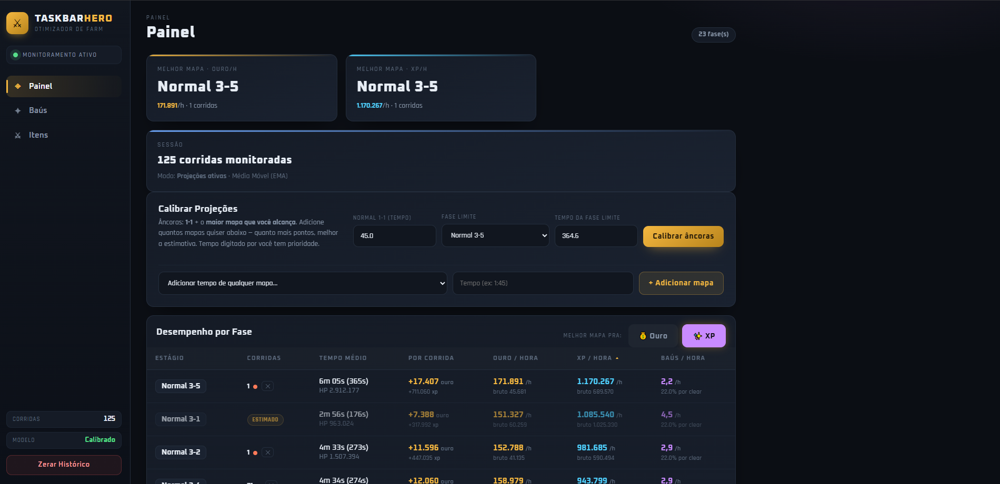
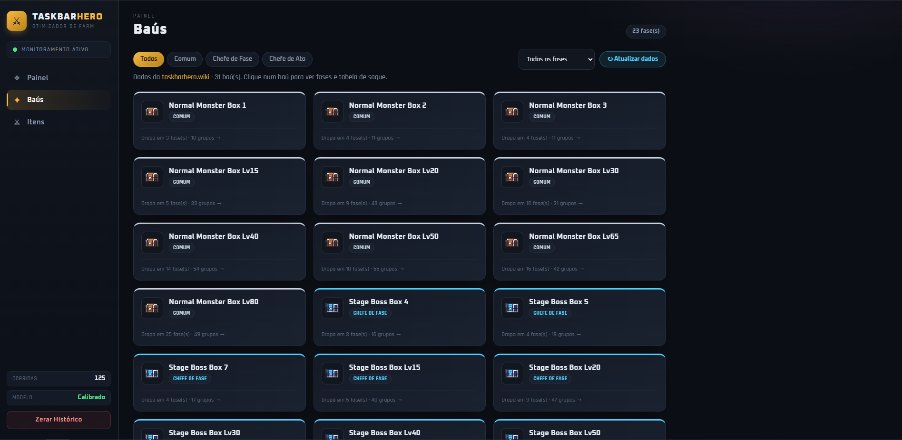
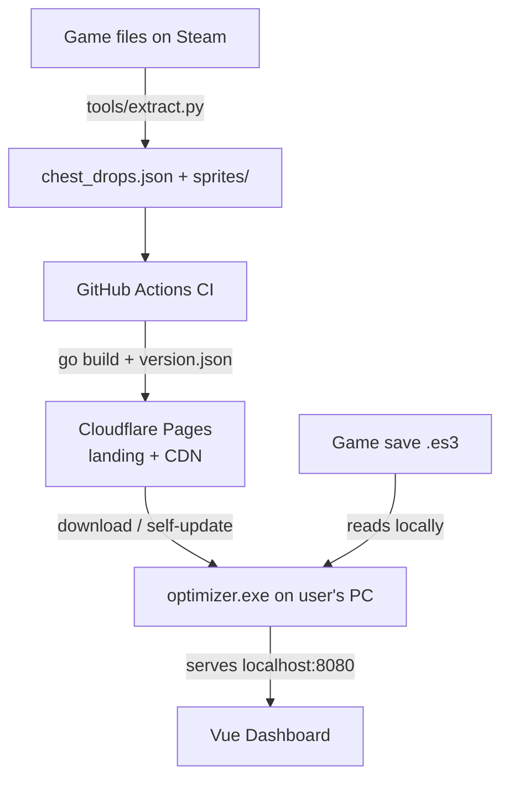

# 🛡️ Taskbar Hero — Farm Optimizer

Desktop tool that reads the **Taskbar Hero** game save in real-time and shows, on a local web dashboard, **where to farm best**: gold/h, XP/h, chest rates, and loot for each stage item by item — with automatic recommendations.

Go backend, Vue 3 dashboard, data extracted directly from the game files (Unity IL2CPP), and distributed via CDN with **auto-updating executable**.

> ⚠️ **Unofficial, fan-made project**. Not affiliated with Nugem Studio / Tesseract Studio. Only **reads** the save (does not modify the game or automate anything). See [License & Game Content](#-license--game-content).



---

## ✨ Features

* **📈 Real-time monitoring** — detects each completed stage by reading the save (event-driven, no polling) and calculates time, gold, and XP per run.
* **📊 Projection by regression + EMA** — estimates the time of any stage using linear regression over the measured stages, and smooths variations with Exponential Moving Average (α = 0.2).
* **🎯 Map recommendation** — choose the focus (gold or XP) and the app points out the best stage among all (measured and estimated).
* **🎁 Chests & item-by-item loot** — chest rate per stage + loot table with rarity and **real sprites** of the items, and reverse search ("which chests drop the Long Sword?").
* **🧙 Character variants (DLC)** — loot changes based on the heroes you own (Hunter, Slayer...); toggles recalculate the chances live.
* **⬇️ Auto-update** — the `.exe` checks a `version.json` on the CDN, downloads the new version, validates the **SHA-256**, and replaces itself (with rollback).
* **🖥️ Embedded dashboard** — Go serves the frontend at `localhost:8080`, with all assets compiled inside the binary via `go:embed`.

---

## 🧩 Technical Highlights

Points that might interest those reading the code:

* **Save decryption (ES3 / Easy Save 3)** — AES-CBC with key derived via PBKDF2-SHA1; the password is injected at build-time (outside the source), it is not hardcoded. → [`internal/decrypt.go`](internal/decrypt.go)
* **Event-driven monitoring** — `fsnotify` watching the directory (not the file, due to ES3's atomic save) + debounce to collapse bursts of events. → [`internal/turnProcessor.go`](internal/turnProcessor.go)
* **Time model by linear regression** (least squares) over HP/waves of measured stages. → [`internal/projection.go`](internal/projection.go)
* **Unity IL2CPP asset extraction** — `tools/extract.py` reads internal CSVs (`*InfoData`) and exports sprites; includes parsing by hand of Unity Localization tables (without typetree) to resolve pt-BR names. → [`tools/extract.py`](tools/extract.py)
* **Secure self-update on Windows** — replaces the binary in use via rename + hash verification. → [`internal/selfupdate.go`](internal/selfupdate.go)

---

## 🛠️ Architecture



1. **Extraction** (`tools/extract.py`): reads game assets and generates `chest_drops.json` + sprites — the same structure that the frontend consumes.
2. **CI/CD** (GitHub Actions): runs the extraction, compiles the `.exe` (injecting the ES3 key via secret), and publishes everything to Cloudflare Pages (download landing + `version.json` + data + binary).
3. **Go App**: monitors the save, serves the API + local dashboard, and auto-updates from the CDN.

---

## 🚀 Running from Source

### Prerequisites
* [Go 1.26+](https://go.dev/dl/)
* [Python 3.10+](https://www.python.org/downloads/) (only to re-extract data): `pip install UnityPy Pillow`

### The decryption key (ES3)
The save is encrypted with a static **ES3** password. It is **not in the code** (public repo). To decrypt, provide it:

* **Local (dev):** set the `TBH_ES3_KEY` environment variable before running.
  ```bash
  # PowerShell
  $env:TBH_ES3_KEY = "<game-es3-password>"
  go run .
  ```
* **Release:** inject into build (embedded in the exe, no env):
  ```bash
  go build -ldflags "-s -w -X optimizer/internal.es3Password=<es3-password>" -o FarmOptimizer.exe .
  ```
> The password can be extracted from the game's `GameAssembly.dll`. It is not distributed here on purpose.

### (Optional) Re-extract game data
```bash
python tools/extract.py gamedata --game "D:/SteamLibrary/steamapps/common/TaskbarHero"
```
Generates `gamedata/chest_drops.json` + sprites. The baseline is already embedded in `web/`.

---

## 📂 Structure

```text
├── internal/
│   ├── decrypt.go        # ES3 decryption (AES-CBC + PBKDF2); key via build/env
│   ├── turnProcessor.go  # event-driven save monitoring + run assignment
│   ├── projection.go     # time model by linear regression
│   ├── stages.go         # report/estimates per stage
│   ├── historyStore.go   # statistics accumulation (EMA) + persistence
│   ├── updater.go        # generation/update of the chest catalog
│   ├── selfupdate.go     # executable auto-update (SHA-256 + rollback)
│   └── server.go         # HTTP server + REST API
├── tools/
│   └── extract.py        # Unity IL2CPP asset extraction -> chest_drops.json + sprites
├── web/                  # frontend (Vue) embedded in binary via go:embed
│   ├── index.html  ·  style.css  ·  chest_drops.json  ·  sprites/
├── site/                 # download landing page (published on Cloudflare Pages)
│   ├── index.html  ·  privacy.html  ·  terms.html
├── main.go               # entry point
├── LICENSE  ·  README.md  ·  .gitignore
```

---

## 📜 License & Game Content

The **code** of this project is licensed under **MIT** — see [LICENSE](LICENSE).

The **game data and assets** (item/stage names, drop tables, sprites) belong to **Nugem Studio & Tesseract Studio** and are **not** covered by the MIT license. This is an unofficial, fan-made utility that only reads the local save — no connection to the developers.
