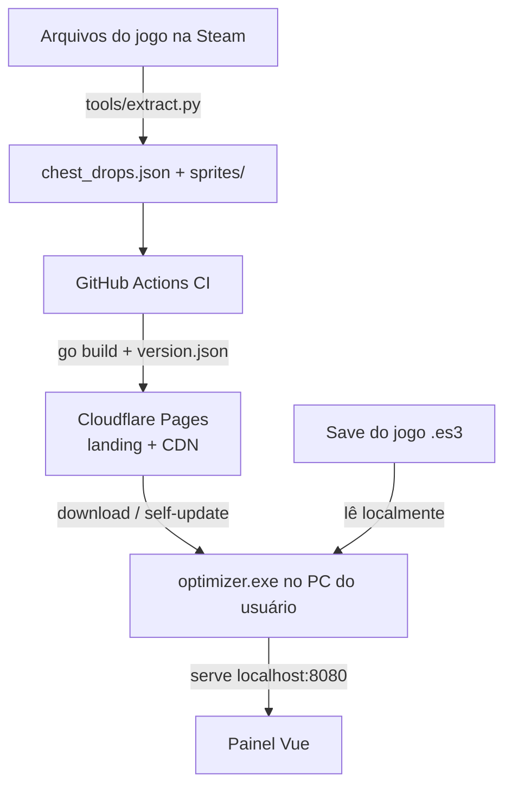

# 🛡️ Taskbar Hero — Farm Optimizer

Ferramenta desktop que lê o save do jogo **Taskbar Hero** em tempo real e mostra, num painel web local, **onde farmar melhor**: ouro/h, XP/h, taxas de baú e o loot de cada fase item a item — com recomendação automática.

Backend em **Go**, painel em **Vue 3**, dados extraídos direto dos arquivos do jogo (Unity IL2CPP) e distribuídos por CDN com **auto-atualização do executável**.

> ⚠️ Projeto **não-oficial, feito por um fã**. Não afiliado à Nugem Studio / Tesseract Studio. Apenas **lê** o save (não modifica o jogo nem automatiza nada). Veja [Licença & Conteúdo do jogo](#-licença--conteúdo-do-jogo).


---

## ✨ Funcionalidades

* **📈 Monitoramento em tempo real** — detecta cada fase concluída lendo o save (event-driven, sem polling) e calcula tempo, ouro e XP por corrida.
* **📊 Projeção por regressão + EMA** — estima o tempo de qualquer fase com regressão linear sobre as fases medidas, e suaviza variações com Média Móvel Exponencial (α = 0.2).
* **🎯 Recomendação de mapa** — escolha o foco (ouro ou XP) e o app aponta a melhor fase entre todas (medidas e estimadas).
* **🎁 Baús & loot item a item** — taxa de baú por fase + tabela de saque com raridade e **sprites reais** dos itens, e busca reversa ("em quais baús cai a Espada Longa?").
* **🧙 Variantes por personagem (DLC)** — o loot muda conforme os heróis que você possui (Caçador, Matador…); toggles recalculam as chances ao vivo.
* **⬇️ Auto-atualização** — o `.exe` checa um `version.json` no CDN, baixa a nova versão, valida o **SHA-256** e se substitui sozinho (com rollback).
* **🖥️ Dashboard embutido** — o Go serve o frontend em `localhost:8080`, com todos os assets compilados dentro do binário via `go:embed`.

---

## 🧩 Destaques técnicos

Pontos que podem interessar quem está lendo o código:

* **Descriptografia do save (ES3 / Easy Save 3)** — AES-CBC com chave derivada por PBKDF2-SHA1; a senha é injetada em build-time (fora do source), não fica hardcoded. → [`internal/decrypt.go`](internal/decrypt.go)
* **Monitoramento event-driven** — `fsnotify` observando o diretório (não o arquivo, por causa do save atômico do ES3) + debounce pra colapsar rajadas de eventos. → [`internal/turnProcessor.go`](internal/turnProcessor.go)
* **Modelo de tempo por regressão linear** (mínimos quadrados) sobre HP/waves das fases medidas. → [`internal/projection.go`](internal/projection.go)
* **Extração de assets Unity IL2CPP** — `tools/extract.py` lê os CSVs internos (`*InfoData`) e exporta sprites; inclui parsing **na unha** das tabelas de Unity Localization (sem typetree) pra resolver nomes pt-BR. → [`tools/extract.py`](tools/extract.py)
* **Self-update seguro no Windows** — troca o binário em uso via rename + verificação de hash. → [`internal/selfupdate.go`](internal/selfupdate.go)

---

## 🛠️ Arquitetura



1. **Extração** (`tools/extract.py`): lê os assets do jogo e gera `chest_drops.json` + sprites — a mesma estrutura que o frontend consome.
2. **CI/CD** (GitHub Actions): roda a extração, compila o `.exe` (injetando a chave ES3 via secret) e publica tudo no Cloudflare Pages (landing de download + `version.json` + dados + binário).
3. **App em Go**: monitora o save, serve a API + painel local, e se auto-atualiza a partir do CDN.

---

## 🚀 Rodando do código-fonte

### Pré-requisitos
* [Go 1.26+](https://go.dev/dl/)
* [Python 3.10+](https://www.python.org/downloads/) (só pra re-extrair os dados): `pip install UnityPy Pillow`

### A chave de descriptografia (ES3)
O save é criptografado com uma senha estática do **ES3**. Ela **não está no código** (repo público). Pra descriptografar, forneça-a:

* **Local (dev):** defina a variável de ambiente `TBH_ES3_KEY` antes de rodar.
  ```bash
  # PowerShell
  $env:TBH_ES3_KEY = "<senha-es3-do-jogo>"
  go run .
  ```
* **Release:** injete no build (fica embutida no exe, sem env):
  ```bash
  go build -ldflags "-s -w -X optimizer/internal.es3Password=<senha-es3>" -o OtimizadorFarm.exe .
  ```
> A senha pode ser extraída do `GameAssembly.dll` do jogo. Não é distribuída aqui de propósito.

### (Opcional) Re-extrair os dados do jogo
```bash
python tools/extract.py gamedata --game "D:/SteamLibrary/steamapps/common/TaskbarHero"
```
Gera `gamedata/chest_drops.json` + sprites. O baseline já vem embutido em `web/`.

---

## 📂 Estrutura

```text
├── internal/
│   ├── decrypt.go        # descriptografia ES3 (AES-CBC + PBKDF2); chave via build/env
│   ├── turnProcessor.go  # monitoramento event-driven do save + atribuição de corridas
│   ├── projection.go     # modelo de tempo por regressão linear
│   ├── stages.go         # relatório/estimativas por fase
│   ├── historyStore.go   # acúmulo de estatísticas (EMA) + persistência
│   ├── updater.go        # geração/atualização do catálogo de baús
│   ├── selfupdate.go     # auto-atualização do executável (SHA-256 + rollback)
│   └── server.go         # servidor HTTP + API REST
├── tools/
│   └── extract.py        # extração de assets Unity IL2CPP -> chest_drops.json + sprites
├── web/                  # frontend (Vue) embutido no binário via go:embed
│   ├── index.html  ·  style.css  ·  chest_drops.json  ·  sprites/
├── site/                 # landing page de download (publicada no Cloudflare Pages)
│   ├── index.html  ·  privacy.html  ·  terms.html
├── main.go               # ponto de entrada
├── LICENSE  ·  README.md  ·  .gitignore
```

---

## 📜 Licença & Conteúdo do jogo

O **código** deste projeto é licenciado sob **MIT** — veja [LICENSE](LICENSE).

Os **dados e assets do jogo** (nomes de itens/fases, tabelas de drop, sprites) pertencem à **Nugem Studio & Tesseract Studio** e **não** são cobertos pela licença MIT. Este é um utilitário não-oficial, feito por um fã, que apenas lê o save local — sem vínculo com os desenvolvedores.
