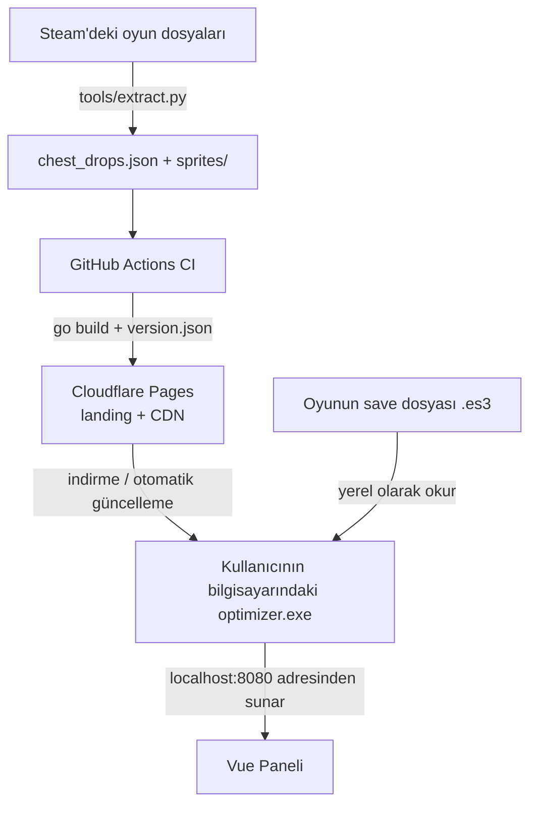

# 🛡️ Taskbar Hero — Farm Optimizer

**Taskbar Hero** oyununun save dosyasını gerçek zamanlı olarak okuyan ve yerel bir web panelinde **en verimli farm yerini** (altın/saat, XP/saat, sandık oranları ve aşama aşama tüm ganimetleri) otomatik önerilerle gösteren masaüstü aracı.

**Go** ile yazılmış backend, **Vue 3** panel, doğrudan oyun dosyalarından (Unity IL2CPP) çıkarılan veriler ve **kendi kendini güncelleyen yürütülebilir dosya (executable)** ile CDN üzerinden dağıtım.

> ⚠️ **Hayran yapımı, resmi olmayan bir proje**. Nugem Studio / Tesseract Studio ile hiçbir bağlantısı yoktur. Sadece save dosyasını **okur** (oyunu değiştirmez veya hiçbir şeyi otomatikleştirmez). Bkz. [Lisans & Oyun İçeriği](#-lisans--oyun-içeriği).


---

## ✨ Özellikler

* **📈 Gerçek zamanlı izleme** — save dosyasını okuyarak tamamlanan her aşamayı algılar (olay tabanlı, anket yöntemi olmadan) ve koşu başına süre, altın ve XP hesaplar.
* **📊 Regresyon + EMA ile projeksiyon** — ölçülen aşamalar üzerinde doğrusal regresyon kullanarak herhangi bir aşamanın süresini tahmin eder ve Üstel Hareketli Ortalama (EMA, α = 0.2) ile dalgalanmaları yumuşatır.
* **🎯 Harita önerisi** — odak noktanızı (altın veya XP) seçin ve uygulama ölçülen ve tahmin edilen tüm aşamalar içinden en iyi haritayı göstersin.
* **🎁 Sandıklar & eşya bazlı ganimet** — aşama başına sandık oranı + nadirlik ve eşyaların **gerçek görselleri (sprite)** ile ganimet tablosu, ayrıca ters arama ("Uzun Kılıç hangi sandıklardan düşer?").
* **🧙 Karakter varyasyonları (DLC)** — sahip olduğunuz kahramanlara göre (Avcı, Katil...) ganimet değişir; anahtarlar (toggles) şansları anlık olarak yeniden hesaplar.
* **⬇️ Otomatik güncelleme** — `.exe` dosyası CDN üzerindeki `version.json` dosyasını kontrol eder, yeni sürümü indirir, **SHA-256** karmasını doğrular ve kendi kendini değiştirir (geri alma desteği ile).
* **🖥️ Yerleşik kontrol paneli** — Go, `go:embed` aracılığıyla ikili dosya (binary) içine derlenmiş tüm varlıklarla birlikte frontend'i `localhost:8080` adresinde sunar.

---

## 🧩 Teknik Öne Çıkanlar

Kodu okuyanların ilgisini çekebilecek noktalar:

* **Save şifre çözme (ES3 / Easy Save 3)** — PBKDF2-SHA1 ile türetilen anahtarla AES-CBC; şifre derleme zamanında (kaynak kodun dışından) enjekte edilir, kod içinde sabit (hardcoded) değildir. → [`internal/decrypt.go`](internal/decrypt.go)
* **Olay tabanlı izleme** — Dizini izleyen `fsnotify` (ES3'ün atomik kaydetmesi nedeniyle dosyanın kendisi değil) + olay patlamalarını daraltmak için debounce. → [`internal/turnProcessor.go`](internal/turnProcessor.go)
* **Doğrusal regresyon ile zaman modeli** — Ölçülen aşamaların HP/dalgalarına dayalı doğrusal regresyon (en küçük kareler) ile zaman modeli. → [`internal/projection.go`](internal/projection.go)
* **Unity IL2CPP varlık çıkarımı** — `tools/extract.py` dahili CSV'leri (`*InfoData`) okur ve görselleri dışa aktarır; pt-BR isimlerini çözmek için Unity Localization tablolarının (typetree olmadan) **manuel olarak** ayrıştırılmasını içerir. → [`tools/extract.py`](tools/extract.py)
* **Windows'ta güvenli kendi kendini güncelleme** — yeniden adlandırma + hash doğrulaması yoluyla kullanımdaki ikili dosyayı değiştirir. → [`internal/selfupdate.go`](internal/selfupdate.go)

---

## 🛠️ Mimari



1. **Çıkarma** (`tools/extract.py`): Oyun varlıklarını okur ve `chest_drops.json` + görselleri (sprites) oluşturur — frontend'in tükettiği yapının aynısıdır.
2. **CI/CD** (GitHub Actions): Çıkarmayı çalıştırır, `.exe` dosyasını derler (ES3 anahtarını gizli bir değişken aracılığıyla enjekte eder) ve her şeyi Cloudflare Pages'te yayınlar (indirme sayfası + `version.json` + veriler + ikili dosya).
3. **Go Uygulaması**: Kayıt dosyasını izler, API + yerel paneli sunar ve CDN'den otomatik olarak güncellenir.

---

## 🚀 Kaynak Koddan Çalıştırma

### Gereksinimler
* [Go 1.26+](https://go.dev/dl/)
* [Python 3.10+](https://www.python.org/downloads/) (yalnızca verileri yeniden çıkarmak için): `pip install UnityPy Pillow`

### Şifre çözme anahtarı (ES3)
Save dosyası statik bir **ES3** şifresiyle şifrelenmiştir. Bu şifre **kodda yoktur** (herkese açık repo). Şifreyi çözmek için bunu sağlayın:

* **Yerel (geliştirme):** Çalıştırmadan önce `TBH_ES3_KEY` ortam değişkenini tanımlayın.
  ```bash
  # PowerShell
  $env:TBH_ES3_KEY = "<oyun-es3-sifresi>"
  go run .
  ```
* **Sürüm (Release):** Derleme sırasında enjekte edin (exe içine gömülür, ortam değişkenine gerek kalmaz):
  ```bash
  go build -ldflags "-s -w -X optimizer/internal.es3Password=<es3-sifresi>" -o FarmOptimizer.exe .
  ```
> Şifre, oyunun `GameAssembly.dll` dosyasından çıkarılabilir. Bilerek buraya eklenmemiştir.

### (İsteğe bağlı) Oyun verilerini yeniden çıkarma
```bash
python tools/extract.py gamedata --game "D:/SteamLibrary/steamapps/common/TaskbarHero"
```
`gamedata/chest_drops.json` + görselleri (sprites) üretir. Temel veriler (baseline) zaten `web/` dizininde yerleşiktir.

---

## 📂 Yapı

```text
├── internal/
│   ├── decrypt.go        # ES3 şifre çözme (AES-CBC + PBKDF2); derleme/ortam değişkeni üzerinden anahtar
│   ├── turnProcessor.go  # save dosyasının olay tabanlı izlenmesi + koşu ataması
│   ├── projection.go     # doğrusal regresyon ile zaman modeli
│   ├── stages.go         # aşama başına rapor/tahminler
│   ├── historyStore.go   # istatistiklerin biriktirilmesi (EMA) + kalıcılık
│   ├── updater.go        # sandık kataloğunun oluşturulması/güncellenmesi
│   ├── selfupdate.go     # yürütülebilir dosyanın otomatik güncellenmesi (SHA-256 + geri alma)
│   └── server.go         # HTTP sunucusu + REST API
├── tools/
│   └── extract.py        # Unity IL2CPP varlık çıkarımı -> chest_drops.json + sprites
├── web/                  # go:embed aracılığıyla ikili dosyaya gömülü frontend (Vue)
│   ├── index.html  ·  style.css  ·  chest_drops.json  ·  sprites/
├── site/                 # indirme açılış sayfası (Cloudflare Pages'te yayınlanır)
│   ├── index.html  ·  privacy.html  ·  terms.html
├── main.go               # giriş noktası
├── LICENSE  ·  README.md  ·  .gitignore
```

---

## 📜 Lisans & Oyun İçeriği

Bu projenin **kodları** **MIT** lisansı altındadır — bkz. [LICENSE](LICENSE).

**Oyun verileri ve varlıkları** (eşya/aşama isimleri, düşme tabloları, görseller) **Nugem Studio & Tesseract Studio**'ya aittir ve MIT lisansı kapsamında **değildir**. Bu, yalnızca yerel save dosyasını okuyan geliştiricilerle hiçbir bağlantısı olmayan resmi olmayan bir hayran aracıdır.
